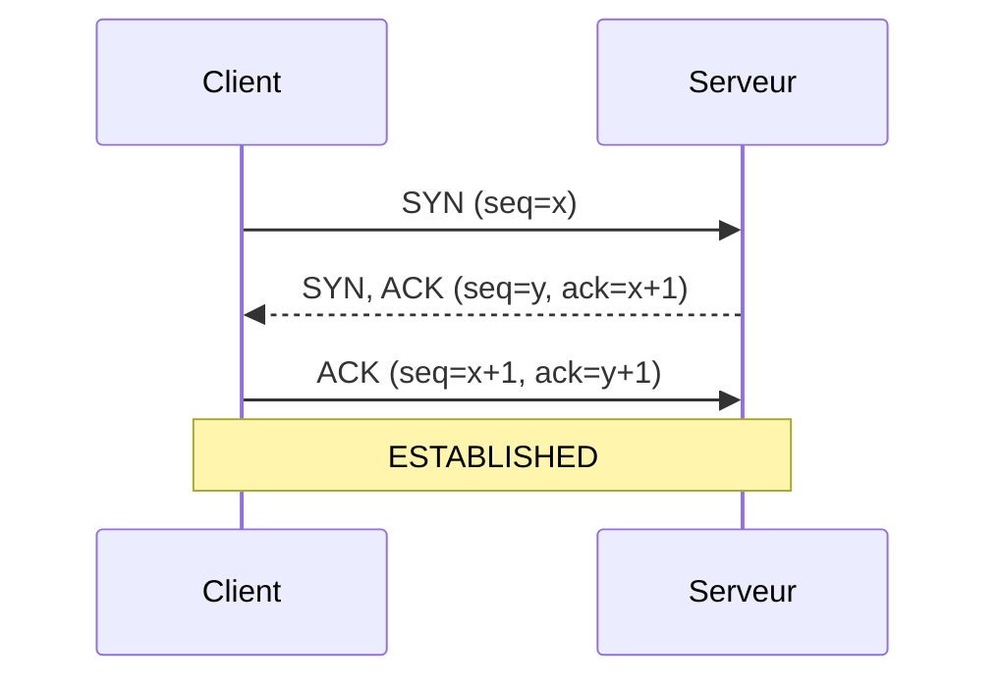
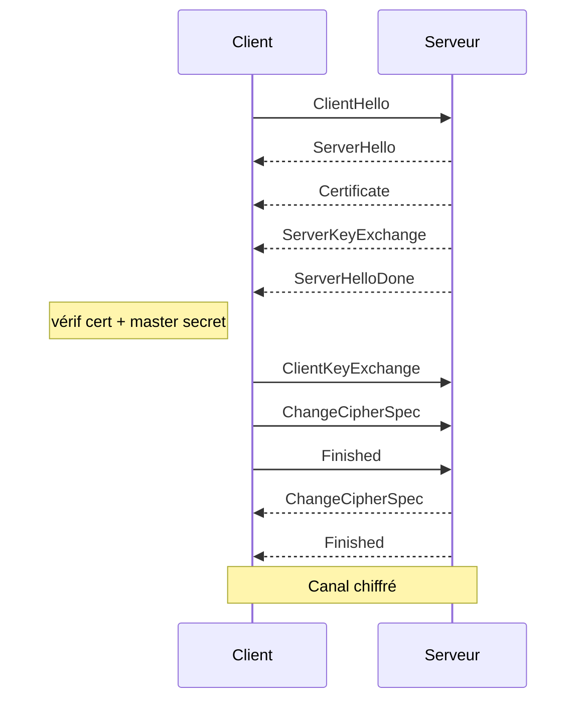

# Rapport — Technologies pour les applications en réseau

**Auteur :** Martin P. — **Date :** avril 2026

---

## 1. Serveur WebSocket + tutoriel Socket.IO ✅

Réalisé avec **Node.js + Express + Socket.IO** en suivant le tutoriel officiel
([socket.io/get-started/chat](https://socket.io/get-started/chat/)).

- Serveur : [../index.js](../index.js)
- Client : [../index.html](../index.html)

```bash
npm install
node index.js
# → http://localhost:3000
```

Mini-chat fonctionnel : chaque message est diffusé à tous les clients via
`io.emit('chat message', msg)`.

> Capture : `captures/chat_socketio.png`

---

## 2. Trace réseau (Wireshark) ✅

Wireshark sur l'interface `lo0`, filtre `tcp.port == 3000`, envoyer un message dans
le chat → on observe :

- le **3-way handshake TCP** (SYN, SYN/ACK, ACK)
- le **GET HTTP** avec en-têtes `Upgrade: websocket` + `Sec-WebSocket-Key`
- la réponse **`101 Switching Protocols`**
- les **frames WebSocket** avec le payload `42["chat message","..."]`

> Captures : `captures/wireshark_handshake.png`, `captures/wireshark_upgrade.png`,
> `captures/wireshark_frame.png`

---

## 3. Burp Suite ✅

1. Lancer Burp → *Proxy → Open browser* (navigateur intégré, pas de config CA).
2. Aller sur `http://localhost:3000`, envoyer un message.
3. Onglet **WebSockets history** → frames visibles en clair.
4. Clic droit → **Send to Repeater** → on peut rejouer/modifier un message.

**Constat :** trafic non chiffré (`ws://`), aucune authentification — il faudrait
`wss://` en prod.

> Captures : `captures/burp_http.png`, `captures/burp_ws.png`,
> `captures/burp_repeater.png`

---

## 4. Scanner de ports ✅ (C++ — bas niveau)

**Fichier :** [code/port_scanner.cpp](code/port_scanner.cpp)

Sockets POSIX BSD, mode non bloquant + `select()` pour le timeout. Équivalent
simplifié de `nmap -sT`.

```bash
$ ./port_scanner 127.0.0.1 1 3100
Scan TCP de 127.0.0.1 (127.0.0.1), ports 1 → 3100
  Port 3000 : OUVERT
Terminé. 1 port(s) ouvert(s) trouvé(s).
```

---

## 5. Simulation TCP handshake ✅ (C++ — bas niveau)

**Fichier :** [code/tcp_handshake.cpp](code/tcp_handshake.cpp)

`fork()` + `socketpair()` : un processus client + un processus serveur s'échangent
des "segments" TCP. Affiche la machine à états (RFC 793).

**Sortie :**
```
[CLIENT ] état=SYN_SENT     | SYN=1 ACK=0 | seq=1000
[SERVEUR] état=SYN_RECEIVED | SYN=1 ACK=1 | seq=4000 ack=1001
[CLIENT ] état=ESTABLISHED  | SYN=0 ACK=1 | seq=1001 ack=4001
[SERVEUR] état=ESTABLISHED
```

### Diagramme de séquence UML



Source : [diagrams/tcp_handshake.mmd](diagrams/tcp_handshake.mmd)

---

## 6. Simulation TLS handshake ✅ (C++ — bas niveau)

**Fichier :** [code/tls_handshake.cpp](code/tls_handshake.cpp)

Même technique (`fork` + `socketpair`). Simule les 10 messages d'un handshake
TLS 1.2 ECDHE-RSA (RFC 5246) : ClientHello → ServerHello → Certificate →
ServerKeyExchange → ServerHelloDone → ClientKeyExchange → ChangeCipherSpec →
Finished × 2.

### Diagramme de séquence UML



Source : [diagrams/tls_handshake.mmd](diagrams/tls_handshake.mmd)

---

## Compilation

```bash
cd rapport/code
make                                  # compile les 3 programmes
./port_scanner 127.0.0.1 1 3100
./tcp_handshake
./tls_handshake
```

---

